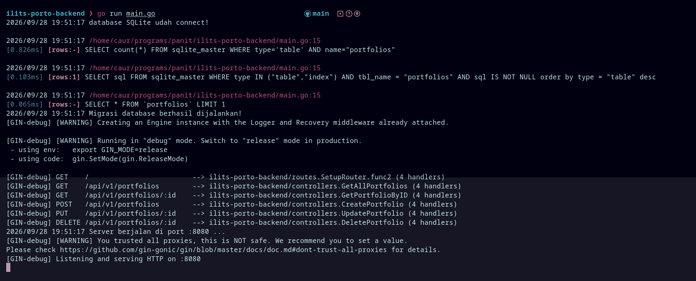
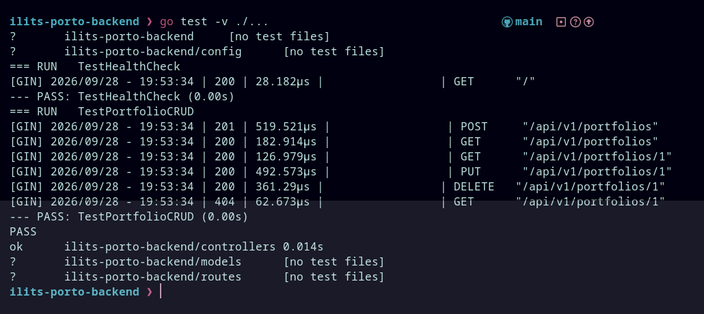
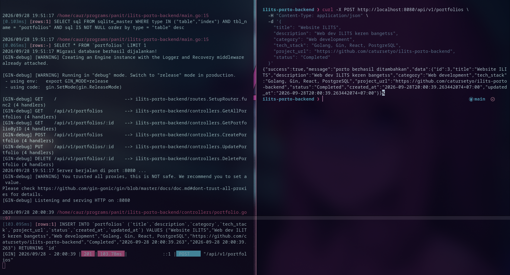
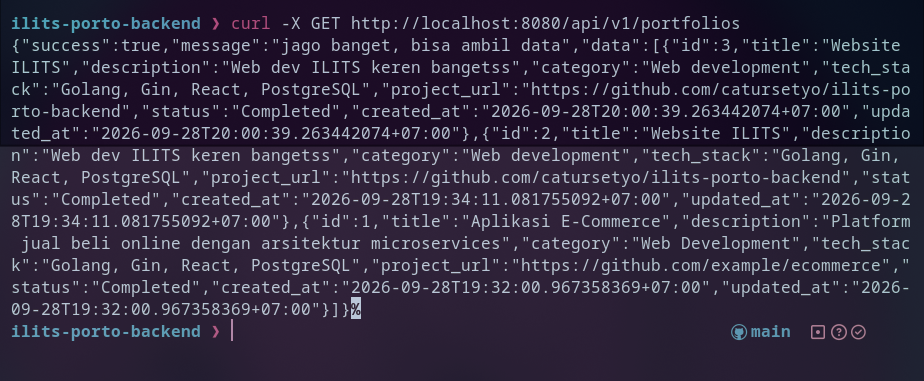
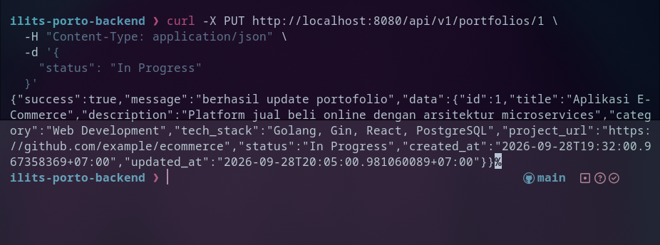
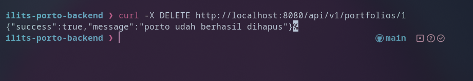

# REST API (Golang + Gin + GORM)

## How to run

### 1. prerequisite
- Go 1.20+

### 2. run server
```bash
go run main.go
```


Server akan aktif di `http://localhost:8080`.

### 3. run test
```bash
go test -v ./...
```


---

## Endpoint REST API

- **`GET /`** - Health check service
- **`GET /api/v1/portfolios`** - Mengambil seluruh daftar portofolio (support `?q=` dan `?category=`)
- **`GET /api/v1/portfolios/:id`** - Mengambil detail portofolio berdasarkan id
- **`POST /api/v1/portfolios`** - Menambahkan portofolio baru
- **`PUT /api/v1/portfolios/:id`** - Memperbarui data portofolio berdasarkan Iid
- **`DELETE /api/v1/portfolios/:id`** - Menghapus portofolio berdasarkan id

---

### Contoh request & response (cURL)

#### 1. tambah data (POST)
```bash
curl -X POST http://localhost:8080/api/v1/portfolios \
  -H "Content-Type: application/json" \
  -d '{
    "title": "Website ILITS",
    "description": "Web dev ILITS keren bangetss",
    "category": "Web development",
    "tech_stack": "Golang, Gin, React, PostgreSQL",
    "project_url": "https://github.com/catursetyo/ilits-porto-backend",
    "status": "Completed"
  }'
```


#### 2. ambil semua data (GET)
```bash
curl -X GET http://localhost:8080/api/v1/portfolios
```
Dengan filter:
```bash
curl -X GET "http://localhost:8080/api/v1/portfolios?category=Web%20Development&q=Golang"
```


#### 3. update data (PUT)
```bash
curl -X PUT http://localhost:8080/api/v1/portfolios/1 \
  -H "Content-Type: application/json" \
  -d '{
    "status": "In Progress"
  }'
```


#### 4. hapus data (DELETE)
```bash
curl -X DELETE http://localhost:8080/api/v1/portfolios/1
```
